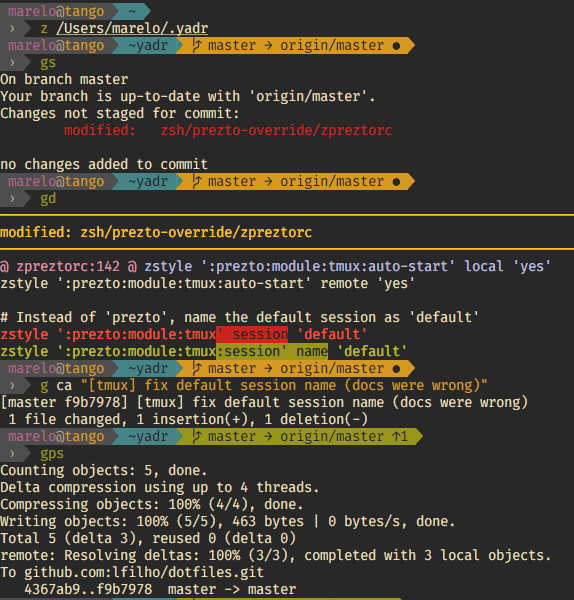
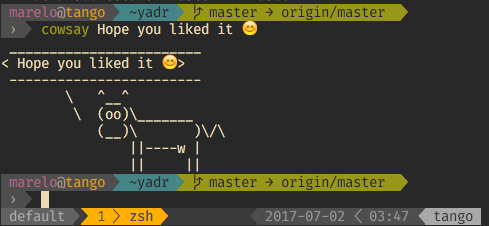

# This is my fork of https://gitter.im/skwp/dotfiles.

     _     _           _
    | |   | |         | |
    | |___| |_____  __| | ____     Yet Another Dotfile Repo
    |_____  (____ |/ _  |/ ___)
     _____| / ___ ( (_| | |        @daxgames's Version
    (_______\_____|\____|_|

&nbsp;&nbsp;&nbsp;&nbsp;&nbsp;&nbsp;&nbsp;&nbsp;&nbsp;&nbsp;&nbsp;&nbsp;&nbsp;&nbsp;&nbsp;&nbsp;&nbsp;&nbsp;&nbsp;&nbsp;&nbsp;&nbsp;&nbsp;&nbsp;&nbsp;&nbsp;&nbsp;&nbsp;&nbsp;&nbsp;&nbsp;&nbsp;&nbsp;&nbsp;&nbsp;&nbsp;&nbsp;&nbsp;&nbsp;&nbsp;&nbsp;&nbsp;&nbsp;&nbsp;&nbsp;&nbsp;&nbsp;&nbsp;&nbsp;&nbsp;&nbsp;&nbsp;[](https://travis-ci.org/daxgames/dotfiles)&nbsp;![PRs Welcome][prs-badge]&nbsp;![macos supported][apple-logo]&nbsp;![linux supported][linux-logo]

```bash
sh -c "`curl -fsSL https://raw.githubusercontent.com/daxgames/dotfiles/main/install.sh`"
```

---

<!-- START doctoc generated TOC please keep comment here to allow auto update -->
<!-- DON'T EDIT THIS SECTION, INSTEAD RE-RUN doctoc TO UPDATE -->
Table of Contents:

- [Installation](#installation)
  - [One liner for OSX and Linux](#one-liner-for-osx-and-linux)
  - [Wait, you're not done!](#wait-youre-not-done)
- [Upgrading](#upgrading)
- [What is YADR?](#what-is-yadr)
- [What is (this fork's version of) YADR?](#what-is-this-forks-version-of-yadr)
- [What's included, how to learn, how to customize?](#whats-included-how-to-learn-how-to-customize)
- [Docker Support](#docker-support)
- [Testing](#testing)
- [Screenshot](#screenshot)
- [Vimization of everything](#vimization-of-everything)
- [OSX](#osx)
- [Credits](#credits)

<!-- END doctoc generated TOC please keep comment here to allow auto update -->

---

## Installation

### One liner for OSX and Linux

_Note: Install on Linux has been verified on Ubuntu and Fedora derivatives. Other distros may require manual intervention._

To get started please run:

```bash
sh -c "`curl -fsSL https://raw.githubusercontent.com/daxgames/dotfiles/main/install.sh`"
```

**Note:** YADR will automatically install all of its subcomponents. If you want to be asked about each one, use:

```bash
sh -c "`curl -fsSL https://raw.githubusercontent.com/daxgames/dotfiles/main/install.sh`" -s ask
```

### Instructions for Linux

_Please do help us improving Linux support in this repo ;-)_

Linux installation can be finnicky depending on the distribution and might require running some commands to install supporting software manually. PRs are welcome! :)

_TIP_: You can check the [`Dockerfile`](./Dockerfile) to see what's need for a basic installation.

### Wait, you're not done!

Remap <kbd>caps-lock</kbd> to <kbd>esc</kbd>!

The <kbd>esc</kbd> key is the single most used key in vim. Old keyboards used to have <kbd>Esc</kbd> where Tab is today. Apple keyboards are the worst with their tiny <kbd>Esc</kbd> keys. But all this is fixed by remapping Caps to <kbd>Esc</kbd>. If you're hitting a small target in the corner, you are slowing yourself down considerably, and probably damaging your hands with repetitive strain injuries.

**For OSX**: with [Karabiner Elements](https://github.com/tekezo/Karabiner-Elements) (you can install it via brew)

**For Ubuntu**: `dconf write /org/gnome/desktop/input-sources/xkb-options "['caps:swapescape']"`

**TODO / IDEA**: Automate this step (saving Karabiner-Elements' .json and loading it after installing the app)

## Upgrading

Upgrading is easy.

```bash
cd ~/.yadr
git pull --rebase
rake update
```

## What is YADR?

**YADR is an opinionated dotfile repo that will make your heart sing**

- The best bits of all the top dotfile repos, vim and zsh plugins curated in one place, into a simple and cohesive way of working.
- Several vim plugins, all under one roof, working together, each plugin researched and configured to be at its best, often with better shortcut keys.
- Many zsh plugins, starting with the wonderful Prezto base, and adding a few niceties on top.
- All things are vimized: command line, irb, postgres command line, tmux, etc.

## What is (this fork's version of) YADR?

This is @daxgames's fork of the great work done by:

- Yan (@skwp), [Yadr - skwp](https://github.com/skwp/dotfiles)
- Luiz (@lfilho), [Yadr - lfilho](https://github.com/lfilho/dotfiles)

Luiz and I have been using YADR for a long time and we have been contributing to it as well. We both decided to fork it and make it our own for a few reasons.

This repo is a combination of the two repos above, with some personal preferences and improvements.

Here are the differences in a nutshell (also make sure you read the [What's included, how to learn, how to customize?](#whats-included-how-to-learn-how-to-customize) section):

- Configurations for both NeoVim([Yadr - lfilho](https://github.com/lfilho/dotfiles)) and Vim in Terminal using MacVim([Yadr - skwp](https://github.com/skwp/dotfiles)).
  - Check them out for details on each, below are the main differences in this combined fork.
- Linux support. I use the repo daily working in both MacOS and Linux.
- Different set of NeoVim/VIM plugins. That's too big of a list to keep up to date here in README so if you're interested you're better off comparing the two repo's plugins. What I can say is:
  - NeoVim is the main focus moving forward.
    - Configuration comes mostly from [Yadr - lfilho](https://github.com/lfilho/dotfiles).
    - Focus on plugins that work better with NeoVim's better features and architecture
    - Removed Coc and replaced it with LSP
    - Added a few more plugins that add some things I/we like.
  - Vim is still supported but not a priority and may eventually be phased out.  I am not sure I am ready to COMPLETELY switch yet!
    - Configuration comes mostly from [Yadr - skwp](https://github.com/skwp/dotfiles)
    - Removed Syntastic and replaced it with ALE.
    - Removed NeoComplete and replaced it with Deoplete.
    - Added a few more plugins that add some things I/we like.
- Homebrew is only used on MacOS in this fork.
- Themes and colors. I am a fan of Solarized but I found it work very differently in various OS and Terminals so I use [OneHalf Dark](https://github.com/sonph/onehalf) for tmux, vim, and terminals.
  - NeoVim/Vim and iTerm2 are configured to use OneHalf Dark.
    - Theme [OneHalf Dark](httos://github.com/sonph/onehalf).

## What's included, how to learn, how to customize?

The best way to learn the answer the the above questions is to browse the README files in each directory (starting with this one). For example, if you're insterested in seeing which vim plugins are there, as well their keymaps, head to [nvim/README.md](./nvim/README.md) and start from there, proceeding to its subfolders' README and finally to each configuration file (there will be more specific comments inside each file).

## Docker Support

We can use Docker to test some changes in a Linux Container.

Assuming your host system has Docker & Docker Compose properly installed, run:

    docker-compose run dotfiles

This will build the container image it never built it before (which may take a while -- future times will be faster) and then run a `zsh` session inside that container for you.
There you can play around, test commands, aliases, etc.

_Warning_: this repo is primarly OSX oriented. So any support for Linux can only be done with the help of the community.

## Testing

We have a basic automated CI testing for both Linux and OSX.
Head to [test/README.md](./test/README.md) for more details.

## Screenshot

Here's how my zsh prompt looks like on iTerm:



And here's another example inside a tmux's pane with tmux's statusline (powerline style):



It's using Gruvbox colors. For screenshots on how Vim looks with Gruvbox, you can check [their gallery](https://github.com/morhetz/gruvbox/wiki/Gallery) out.

## Vimization of everything

The provided inputrc and editrc will turn your various command line tools like mysql and irb into vim prompts.
There's also an included Ctrl-R reverse history search feature in editrc, very useful in irb, postgres command line, and etc.

_Note: The below user config paths are not committed back to Git, so you can add your own plugins and configuration without polluting the main repo._

- Add user plugins to `~/.config/nvim/plugins/*userplugin*.vim`.
- Add user settings or plugin config to:
  - `~/.config/nvim/settings/{before,after}/*userconfig*.vim`.
  - `~/.config/nvim/settings/{before,after}/*userplugin*.vim`.
  - `~/.config/nvim/settings/*userconfig*.vim`.
  - `~/.config/nvim/settings/*userplugin*.vim`.

## OSX

See [Other recommended OSX productivity tools](doc/osx_tools.md).

Also, the a osx file is a bash script that sets up sensible defaults for devs and power users under osx. Read through it before running it. To use:

    bin/osx

These hacks are Lion-centric. May not work for other OS'es. My favorite mods include:

- Ultra fast key repeat rate (now you can scroll super quick using j/k)
- No disk image verification (downloaded files open quicker)
- Display the `~/Library` folder in finder (hidden in Lion)

## Credits

See [Credits & Thanks](doc/credits.md)

[apple-logo]: https://img.shields.io/badge/macos-supported-blue.svg?logo=data%3Aimage%2Fpng%3Bbase64%2CiVBORw0KGgoAAAANSUhEUgAAABEAAAAUCAYAAABroNZJAAAABGdBTUEAALGPC%2FxhBQAAACBjSFJNAAB6JgAAgIQAAPoAAACA6AAAdTAAAOpgAAA6mAAAF3CculE8AAAACXBIWXMAAAsTAAALEwEAmpwYAAACAmlUWHRYTUw6Y29tLmFkb2JlLnhtcAAAAAAAPHg6eG1wbWV0YSB4bWxuczp4PSJhZG9iZTpuczptZXRhLyIgeDp4bXB0az0iWE1QIENvcmUgNS40LjAiPgogICA8cmRmOlJERiB4bWxuczpyZGY9Imh0dHA6Ly93d3cudzMub3JnLzE5OTkvMDIvMjItcmRmLXN5bnRheC1ucyMiPgogICAgICA8cmRmOkRlc2NyaXB0aW9uIHJkZjphYm91dD0iIgogICAgICAgICAgICB4bWxuczpleGlmPSJodHRwOi8vbnMuYWRvYmUuY29tL2V4aWYvMS4wLyIKICAgICAgICAgICAgeG1sbnM6dGlmZj0iaHR0cDovL25zLmFkb2JlLmNvbS90aWZmLzEuMC8iPgogICAgICAgICA8ZXhpZjpQaXhlbFlEaW1lbnNpb24%2BNjY8L2V4aWY6UGl4ZWxZRGltZW5zaW9uPgogICAgICAgICA8ZXhpZjpQaXhlbFhEaW1lbnNpb24%2BNTU8L2V4aWY6UGl4ZWxYRGltZW5zaW9uPgogICAgICAgICA8dGlmZjpPcmllbnRhdGlvbj4xPC90aWZmOk9yaWVudGF0aW9uPgogICAgICA8L3JkZjpEZXNjcmlwdGlvbj4KICAgPC9yZGY6UkRGPgo8L3g6eG1wbWV0YT4Ktkd%2F7gAAAiNJREFUOBGNUz1rG0EQ1UnRSZiDRMYmjbqAITJJpUaV22DiXxDSmYB%2FgcH%2FJFWKNCFpTH6CW0FUBKH0EVKEkC46fZ10H%2Bv35naPUyJbWpibnTezb2dn5nK5PZZSqgDJ7xG6PYQE2z17oobA87yTxWJxOxwO3%2FKowR%2BkYYCWIoMGg8GLIAi8MAwVSOrEHiSBIw%2BxGJRdURR9Aa6gPxhcx6Y1ekIHQcuyYu6n0%2BnLUqlk%2B77fbTabDm5%2FE8fxD8dxOsDOkdFvxP7cOEcCAu12216v158RhEujJeTPfD4f9Pv9eDKZLPkcYAo6ANm3Xq93ZIiYhTwBBJ8YlBX40qXxAFkp1EiNx%2BNXmiTp3mw2e61vihHMVKhlZXCcj2GGCsW%2B0gRSDvnYtn2GdxIPIdIVaAE0zn2MfQFPcVut1i1sLqmj1APOpwm2%2B4v0lp1OZ8lInFPUpk1rGjuWhQLl0LnDRqNxzFjYUg8hAbu0DPhjI06SsFgslmu12rW%2BMAImz865rvsMBeuCjN3h2uhS1jbFXa1WNyYbTmmhUqn8hfOrYdd6q2I2LDZ0VQeIIU8ajUZVZOOCjFn4kAAik6f3tH36ETdEm5%2BTBGRJXbGRVmMy33OQEJwKDqR74rTR5gtNIOeSoiSMyNJSGLx35XL5EsRTvPsOk%2FwLc3SKrtThPwDJR%2Fi%2Fw1%2BAHZFsY8GRkm44%2FjEQZ0ZDPP8dMjdowmzLza38481eSO4BM4sOer2f%2BQ4AAAAASUVORK5CYII%3D
[linux-logo]: https://img.shields.io/badge/linux-supported-blue.svg?logo=data%3Aimage%2Fpng%3Bbase64%2CiVBORw0KGgoAAAANSUhEUgAAABAAAAAUCAQAAAAua3X8AAAABGdBTUEAALGPC%2FxhBQAAACBjSFJNAAB6JgAAgIQAAPoAAACA6AAAdTAAAOpgAAA6mAAAF3CculE8AAAACXBIWXMAAAsTAAALEwEAmpwYAAACAmlUWHRYTUw6Y29tLmFkb2JlLnhtcAAAAAAAPHg6eG1wbWV0YSB4bWxuczp4PSJhZG9iZTpuczptZXRhLyIgeDp4bXB0az0iWE1QIENvcmUgNS40LjAiPgogICA8cmRmOlJERiB4bWxuczpyZGY9Imh0dHA6Ly93d3cudzMub3JnLzE5OTkvMDIvMjItcmRmLXN5bnRheC1ucyMiPgogICAgICA8cmRmOkRlc2NyaXB0aW9uIHJkZjphYm91dD0iIgogICAgICAgICAgICB4bWxuczpleGlmPSJodHRwOi8vbnMuYWRvYmUuY29tL2V4aWYvMS4wLyIKICAgICAgICAgICAgeG1sbnM6dGlmZj0iaHR0cDovL25zLmFkb2JlLmNvbS90aWZmLzEuMC8iPgogICAgICAgICA8ZXhpZjpQaXhlbFlEaW1lbnNpb24%2BNjc8L2V4aWY6UGl4ZWxZRGltZW5zaW9uPgogICAgICAgICA8ZXhpZjpQaXhlbFhEaW1lbnNpb24%2BNTQ8L2V4aWY6UGl4ZWxYRGltZW5zaW9uPgogICAgICAgICA8dGlmZjpPcmllbnRhdGlvbj4xPC90aWZmOk9yaWVudGF0aW9uPgogICAgICA8L3JkZjpEZXNjcmlwdGlvbj4KICAgPC9yZGY6UkRGPgo8L3g6eG1wbWV0YT4KcLJ2GgAAAcxJREFUGBllwU1I02EcwPHv83se3dCckcOXxRQlxKRBmaBR4MjOBQWG125FFOJB6NQLFBRd6hiEZyGhIDpECRZRhNBBoRcKmZfKynAbbv6359f21xHR58Nfatimwv%2FUwMpQ8VJ2TOtBhX%2BphdWRTfVa0NW5r42ghpCwxYCezFHeyAQN6abTgCUkbPHwI%2FmeTN1zVqgbAJSQUGWMh%2FyOF1zAmhhBF6CEhJro554mkiYjedaGx%2BPGq1AhVMwIDCWlK8WYfJRXpdb4%2BYuApUYdZG7d177gmPbruA80W3o4CDOWKrUwu3dj87L2l9N6VAd0Nijqt5dUqBFCh859qHsUxMXjCXjtNsuRw0ujgBUVU77eEju1RME6qiKsUlClLU2FLFjoPVHq%2BFRChCpLjjWiNCUBL4MBPJ04Q8p0k8XhaWQPu8lzI0H9FXEwdWdx32LpoLvLJN8BhzJhlulpVmuc%2FZl8Nr3gOv0bc8Bk9W3Z%2BuM%2BwQPJkWvPtM89cbsibdECeRfovdI1l3bNDDPNuj8izjnMhk2vt7%2FbX%2B5uaY11SrRoHv%2BeX%2F6S6NjZ0Od%2FXb05Sc1U8%2Fzo7bOkCOUTOjLaS5UB5hzCNhW1KoRUMPAHBgywCw3JeWgAAAAASUVORK5CYII%3D
[prs-badge]: https://img.shields.io/badge/PRs-welcome-brightgreen.svg?style=flat&logo=data%3Aimage%2Fpng%3Bbase64%2CiVBORw0KGgoAAAANSUhEUgAAACAAAAAgCAMAAABEpIrGAAACWFBMVEXXWkrXWkrXWkrXWkrXWkrXWkrXWkrXWkrXWkrXWkrXWkrXWkrXWkrXWkrXWkrXWkrXWkrXWkrXWkrXWkrXWkrXWkrXWkrXWkrXWkrXWkrXWkrXWkrXWkrXWkrXWkrXWkrXWkrXWkrXWkrXWkrXWkrXWkrXWkrXWkrXWkrXWkrXWkrXWkrXWkrXWkrXWkrXWkrXWkrXWkrXWkrXWkrXWkrXWkrXWkrXWkrXWkrXWkrXWkrXWkrXWkrXWkrXWkrXWkrXWkrXWkrXWkrXWkrXWkrXWkrXWkrXWkrXWkrXWkrXWkrXWkrXWkrXWkrXWkrXWkrXWkrXWkrXWkrXWkrXWkrXWkrXWkrXWkrXWkrXWkrXWkrXWkrXWkrXWkrXWkrXWkrXWkrXWkrXWkrXWkrXWkrXWkrXWkrXWkrXWkrXWkrXWkrXWkrXWkrXWkrXWkrXWkrXWkrXWkrXWkrXWkrXWkrXWkrXWkrXWkrXWkrXWkrXWkrXWkrXWkrXWkrXWkrXWkrXWkrXWkrXWkrXWkrXWkrXWkrXWkrXWkrXWkrXWkrXWkrXWkrXWkrXWkrXWkrXWkrXWkrXWkrXWkrXWkrXWkrXWkrXWkrXWkrXWkrXWkrXWkrXWkrXWkrXWkrXWkrXWkrXWkrXWkrXWkrXWkrXWkrXWkrXWkrXWkrXWkrXWkrXWkrXWkrXWkrXWkrXWkrXWkrXWkrXWkrXWkrXWkrXWkrXWkrXWkrXWkrXWkrXWkrXWkrXWkrXWkrXWkrXWkrXWkrXWkrXWkrXWkrXWkrXWkrXWkrXWkrXWko2FeWCAAAAAXRSTlMAQObYZgAAAAFiS0dEAIgFHUgAAAAJcEhZcwAAI28AACNvATX8B%2FsAAAAHdElNRQfhBQMBMCLAfV85AAAAi0lEQVQ4y2NgIBYszkPmJc5ORZE9DgEJqNxmmPS%2B43AA4h5B5TIwbD5%2BHFnoKCoXYSBMBIW7CF0eAxChoPM4ARXHB4GCZEIKKA8H%2FCoWE1LAwIBfBVp6wQA1DPhVzMJMcyggCVuqxGI%2FLhWY6Z6QPKoK7HmHkDwDwxYC8gwMdSDprXiz6PHjpQxUBgCLDfI7GXNh5gAAAABJRU5ErkJggg%3D%3D
